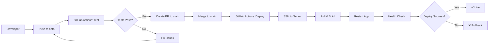

# 🚀 Deployment Guide

## GitHub Actions CI/CD Setup

### 📋 Overview

Dự án sử dụng **GitHub Actions** để tự động deploy:

- **Beta Branch** → Chạy tests & lint
- **Main Branch** → Deploy to production server

### 🔐 Required GitHub Secrets

Vào **Settings** → **Secrets and variables** → **Actions** và thêm:

#### 1. `SERVER_HOST`
```
144.91.104.237
```

#### 2. `SERVER_USER`  
```
root
```

#### 3. `SERVER_SSH_KEY`
SSH private key để connect server. Tạo như sau:

```bash
# Trên máy local, tạo SSH key pair
ssh-keygen -t rsa -b 4096 -C "github-actions@toeicai.com" -f ~/.ssh/toeicai_deploy

# Copy public key lên server
ssh-copy-id -i ~/.ssh/toeicai_deploy.pub root@144.91.104.237

# Copy private key content vào GitHub Secret
cat ~/.ssh/toeicai_deploy
```

### 🔄 Workflow Triggers

#### **Test Workflow** (`.github/workflows/test.yml`)
**Triggers:**
- Push to `beta` or `main` branch
- Pull request to `main` branch

**Steps:**
1. ✅ Checkout code
2. ✅ Setup Node.js 18
3. ✅ Install dependencies
4. ✅ Lint code
5. ✅ Check formatting
6. ✅ Build project
7. ✅ Run tests with PostgreSQL

#### **Deploy Workflow** (`.github/workflows/deploy.yml`)
**Triggers:**
- Push to `main` branch only
- Manual trigger via GitHub UI

**Steps:**
1. ✅ Checkout code
2. ✅ Setup Node.js 18
3. ✅ Install dependencies
4. ✅ Run tests
5. ✅ Build project
6. 🚀 SSH to server and deploy
7. ✅ Health check
8. 📊 Status notification

### 🛠️ Server Deployment Process

Khi push lên `main`, GitHub Actions sẽ:

1. **Pull latest code** từ main branch
2. **Install dependencies** với `npm ci`
3. **Build project** với `npm run build`
4. **Stop old process** gracefully
5. **Start new process** với `npm run start:prod`
6. **Health check** API endpoints
7. **Report status** success/failure

### 📁 Server Structure

```
/var/www/toeicai/ToeicBoost_BE/
├── .git/                 # Git repository
├── src/                  # Source code
├── dist/                 # Built files
├── node_modules/         # Dependencies
├── .env                  # Environment config
├── app.log              # Application logs
└── package.json         # Project config
```

### 🔍 Monitoring & Debugging

#### **Check Deployment Status**
- GitHub Actions tab trong repository
- Real-time logs của deployment process

#### **Server Health Check**
```bash
# SSH vào server
ssh root@144.91.104.237

# Check process
ps aux | grep node

# Check logs
cd /var/www/toeicai/ToeicBoost_BE
tail -f app.log

# Test API
curl http://localhost:3001/
curl http://localhost:3001/api_v1/docs
```

#### **Manual Restart** (nếu cần)
```bash
ssh root@144.91.104.237
cd /var/www/toeicai/ToeicBoost_BE

# Stop
pkill -f "node.*dist/main.js"

# Start
nohup npm run start:prod > app.log 2>&1 &
```

### 🚦 Deployment Flow



### 📊 API Endpoints (Production)

| Endpoint | URL | Description |
|----------|-----|-------------|
| Health Check | `http://144.91.104.237:3001/` | Simple health |
| Detailed Health | `http://144.91.104.237:3001/health` | System info |
| Swagger Docs | `http://144.91.104.237:3001/api_v1/docs` | API documentation |
| Register | `POST http://144.91.104.237:3001/api_v1/auth/register` | User registration |
| Login | `POST http://144.91.104.237:3001/api_v1/auth/login` | User login |
| Refresh Token | `POST http://144.91.104.237:3001/api_v1/auth/refresh` | Token refresh |
| Logout | `POST http://144.91.104.237:3001/api_v1/auth/logout` | User logout |
| Get Profile | `GET http://144.91.104.237:3001/api_v1/auth/me` | User profile |

### 🔧 Environment Variables (Production)

Server `.env` file:
```bash
NODE_ENV=production
APP_PORT=3001
APP_NAME=toeic-ai-api
API_PREFIX=api_v1

DB_HOST=144.91.104.237
DB_PORT=5433
DB_USERNAME=toeicai_user
DB_PASSWORD=StrongPassword123!
DB_DATABASE=toeicai

JWT_ACCESS_SECRET=production-access-secret
JWT_REFRESH_SECRET=production-refresh-secret
JWT_ACCESS_EXPIRATION=15m
JWT_REFRESH_EXPIRATION=7d

THROTTLE_TTL=60
THROTTLE_LIMIT=60
```

### 🚨 Troubleshooting

#### **Deployment Failed**
1. Check GitHub Actions logs
2. SSH to server and check `app.log`
3. Verify environment variables
4. Check database connection

#### **API Not Responding**
1. Check if process is running: `ps aux | grep node`
2. Check port 3001: `netstat -tlnp | grep 3001`
3. Check firewall: `ufw status`
4. Restart manually if needed

#### **Database Issues**
1. Check PostgreSQL status: `systemctl status postgresql`
2. Test connection: `psql -h 144.91.104.237 -p 5433 -U toeicai_user -d toeicai`
3. Check migrations: `npm run migration:show`

### 📝 Best Practices

1. **Always test on beta first** before merging to main
2. **Use descriptive commit messages** for better tracking
3. **Monitor deployment logs** after each release
4. **Keep environment secrets secure** in GitHub Secrets
5. **Regular database backups** before major deployments

### 🎯 Next Steps

1. ✅ Setup GitHub Secrets
2. ✅ Test deployment workflow
3. ✅ Monitor first production deployment
4. ✅ Setup monitoring & alerting
5. ✅ Configure SSL/HTTPS
6. ✅ Setup domain name
7. ✅ Add database backup automation